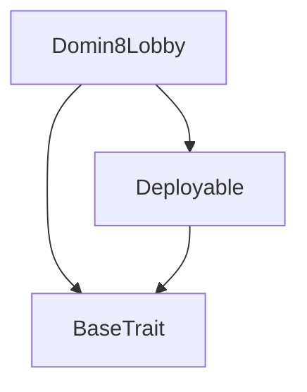
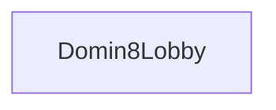

# Tact compilation report
Contract: Domin8Lobby
BoC Size: 1487 bytes

## Structures (Structs and Messages)
Total structures: 37

### DataSize
TL-B: `_ cells:int257 bits:int257 refs:int257 = DataSize`
Signature: `DataSize{cells:int257,bits:int257,refs:int257}`

### SignedBundle
TL-B: `_ signature:fixed_bytes64 signedData:remainder<slice> = SignedBundle`
Signature: `SignedBundle{signature:fixed_bytes64,signedData:remainder<slice>}`

### StateInit
TL-B: `_ code:^cell data:^cell = StateInit`
Signature: `StateInit{code:^cell,data:^cell}`

### Context
TL-B: `_ bounceable:bool sender:address value:int257 raw:^slice = Context`
Signature: `Context{bounceable:bool,sender:address,value:int257,raw:^slice}`

### SendParameters
TL-B: `_ mode:int257 body:Maybe ^cell code:Maybe ^cell data:Maybe ^cell value:int257 to:address bounce:bool = SendParameters`
Signature: `SendParameters{mode:int257,body:Maybe ^cell,code:Maybe ^cell,data:Maybe ^cell,value:int257,to:address,bounce:bool}`

### MessageParameters
TL-B: `_ mode:int257 body:Maybe ^cell value:int257 to:address bounce:bool = MessageParameters`
Signature: `MessageParameters{mode:int257,body:Maybe ^cell,value:int257,to:address,bounce:bool}`

### DeployParameters
TL-B: `_ mode:int257 body:Maybe ^cell value:int257 bounce:bool init:StateInit{code:^cell,data:^cell} = DeployParameters`
Signature: `DeployParameters{mode:int257,body:Maybe ^cell,value:int257,bounce:bool,init:StateInit{code:^cell,data:^cell}}`

### StdAddress
TL-B: `_ workchain:int8 address:uint256 = StdAddress`
Signature: `StdAddress{workchain:int8,address:uint256}`

### VarAddress
TL-B: `_ workchain:int32 address:^slice = VarAddress`
Signature: `VarAddress{workchain:int32,address:^slice}`

### BasechainAddress
TL-B: `_ hash:Maybe int257 = BasechainAddress`
Signature: `BasechainAddress{hash:Maybe int257}`

### Deploy
TL-B: `deploy#946a98b6 queryId:uint64 = Deploy`
Signature: `Deploy{queryId:uint64}`

### DeployOk
TL-B: `deploy_ok#aff90f57 queryId:uint64 = DeployOk`
Signature: `DeployOk{queryId:uint64}`

### FactoryDeploy
TL-B: `factory_deploy#6d0ff13b queryId:uint64 cashback:address = FactoryDeploy`
Signature: `FactoryDeploy{queryId:uint64,cashback:address}`

### ChangeOwner
TL-B: `change_owner#819dbe99 queryId:uint64 newOwner:address = ChangeOwner`
Signature: `ChangeOwner{queryId:uint64,newOwner:address}`

### ChangeOwnerOk
TL-B: `change_owner_ok#327b2b4a queryId:uint64 newOwner:address = ChangeOwnerOk`
Signature: `ChangeOwnerOk{queryId:uint64,newOwner:address}`

### InitConfig
TL-B: `init_config#9f5d0040 treasury:address houseFee:uint16 minBet:coins maxBet:coins roundTime:uint32 = InitConfig`
Signature: `InitConfig{treasury:address,houseFee:uint16,minBet:coins,maxBet:coins,roundTime:uint32}`

### Withdraw
TL-B: `withdraw#0ba69751 amount:coins = Withdraw`
Signature: `Withdraw{amount:coins}`

### CreateGame
TL-B: `create_game#c90dfe02 mapId:uint8 commitHash:uint256 = CreateGame`
Signature: `CreateGame{mapId:uint8,commitHash:uint256}`

### SetGameConfig
TL-B: `set_game_config#2f5348ac houseFee:uint16 minBet:coins maxBet:coins roundTime:uint32 mapId:uint8 commitHash:uint256 = SetGameConfig`
Signature: `SetGameConfig{houseFee:uint16,minBet:coins,maxBet:coins,roundTime:uint32,mapId:uint8,commitHash:uint256}`

### PlaceBet
TL-B: `place_bet#aa44039c skin:uint8 posX:uint16 posY:uint16 = PlaceBet`
Signature: `PlaceBet{skin:uint8,posX:uint16,posY:uint16}`

### RevealAndEnd
TL-B: `reveal_and_end#7645a2e7 secret:uint256 = RevealAndEnd`
Signature: `RevealAndEnd{secret:uint256}`

### ClaimPrize
TL-B: `claim_prize#9d546687  = ClaimPrize`
Signature: `ClaimPrize{}`

### CreateLobby
TL-B: `create_lobby#ed0a8e4c mapId:uint8 skin:uint8 commitHash:uint256 = CreateLobby`
Signature: `CreateLobby{mapId:uint8,skin:uint8,commitHash:uint256}`

### SetLobbyConfig
TL-B: `set_lobby_config#8ff69549 playerA:address amount:coins houseFee:uint16 mapId:uint8 skinA:uint8 commitHash:uint256 = SetLobbyConfig`
Signature: `SetLobbyConfig{playerA:address,amount:coins,houseFee:uint16,mapId:uint8,skinA:uint8,commitHash:uint256}`

### JoinLobby
TL-B: `join_lobby#fbbd3a85 skin:uint8 = JoinLobby`
Signature: `JoinLobby{skin:uint8}`

### SettleLobby
TL-B: `settle_lobby#3caf0788 lobbyId:uint64 secret:uint256 = SettleLobby`
Signature: `SettleLobby{lobbyId:uint64,secret:uint256}`

### RescueLobby
TL-B: `rescue_lobby#28941e49 lobbyId:uint64 = RescueLobby`
Signature: `RescueLobby{lobbyId:uint64}`

### InternalGameEnded
TL-B: `internal_game_ended#ee3c5e88 gameId:uint64 winner:address prize:coins fee:coins = InternalGameEnded`
Signature: `InternalGameEnded{gameId:uint64,winner:address,prize:coins,fee:coins}`

### InternalLobbySettled
TL-B: `internal_lobby_settled#991c80a0 lobbyId:uint64 winner:address prize:coins fee:coins = InternalLobbySettled`
Signature: `InternalLobbySettled{lobbyId:uint64,winner:address,prize:coins,fee:coins}`

### InternalUnlock
TL-B: `internal_unlock#a0d1042a  = InternalUnlock`
Signature: `InternalUnlock{}`

### BetInfo
TL-B: `_ player:address amount:coins skin:uint8 posX:uint16 posY:uint16 = BetInfo`
Signature: `BetInfo{player:address,amount:coins,skin:uint8,posX:uint16,posY:uint16}`

### GameState
TL-B: `_ gameId:uint64 status:uint8 mapId:uint8 startDate:uint64 endDate:uint64 totalPot:coins betCount:uint32 userCount:uint32 winner:address winnerPrize:coins prizeSent:bool = GameState`
Signature: `GameState{gameId:uint64,status:uint8,mapId:uint8,startDate:uint64,endDate:uint64,totalPot:coins,betCount:uint32,userCount:uint32,winner:address,winnerPrize:coins,prizeSent:bool}`

### LobbyState
TL-B: `_ lobbyId:uint64 status:uint8 playerA:address playerB:address amount:coins mapId:uint8 skinA:uint8 skinB:uint8 winner:address createdAt:uint64 = LobbyState`
Signature: `LobbyState{lobbyId:uint64,status:uint8,playerA:address,playerB:address,amount:coins,mapId:uint8,skinA:uint8,skinB:uint8,winner:address,createdAt:uint64}`

### MasterConfig
TL-B: `_ admin:address treasury:address houseFee:uint16 minBet:coins maxBet:coins roundTime:uint32 currentRound:uint64 lobbyCount:uint64 locked:bool = MasterConfig`
Signature: `MasterConfig{admin:address,treasury:address,houseFee:uint16,minBet:coins,maxBet:coins,roundTime:uint32,currentRound:uint64,lobbyCount:uint64,locked:bool}`

### Domin8Game$Data
TL-B: `_ parent:address gameId:uint64 configured:bool houseFee:uint16 minBet:coins maxBet:coins roundTime:uint32 mapId:uint8 commitHash:uint256 status:uint8 startDate:uint64 endDate:uint64 totalPot:coins betCount:uint32 userCount:uint32 winner:address winnerPrize:coins prizeSent:bool bets:dict<uint32, ^BetInfo{player:address,amount:coins,skin:uint8,posX:uint16,posY:uint16}> playerBetCounts:dict<address, uint32> = Domin8Game`
Signature: `Domin8Game{parent:address,gameId:uint64,configured:bool,houseFee:uint16,minBet:coins,maxBet:coins,roundTime:uint32,mapId:uint8,commitHash:uint256,status:uint8,startDate:uint64,endDate:uint64,totalPot:coins,betCount:uint32,userCount:uint32,winner:address,winnerPrize:coins,prizeSent:bool,bets:dict<uint32, ^BetInfo{player:address,amount:coins,skin:uint8,posX:uint16,posY:uint16}>,playerBetCounts:dict<address, uint32>}`

### Domin8Lobby$Data
TL-B: `_ parent:address lobbyId:uint64 configured:bool playerA:address playerB:address amount:coins houseFee:uint16 mapId:uint8 skinA:uint8 skinB:uint8 commitHash:uint256 status:uint8 winner:address createdAt:uint64 = Domin8Lobby`
Signature: `Domin8Lobby{parent:address,lobbyId:uint64,configured:bool,playerA:address,playerB:address,amount:coins,houseFee:uint16,mapId:uint8,skinA:uint8,skinB:uint8,commitHash:uint256,status:uint8,winner:address,createdAt:uint64}`

### Domin8$Data
TL-B: `_ owner:address treasury:address houseFee:uint16 minBet:coins maxBet:coins roundTime:uint32 currentRound:uint64 lobbyCount:uint64 locked:bool = Domin8`
Signature: `Domin8{owner:address,treasury:address,houseFee:uint16,minBet:coins,maxBet:coins,roundTime:uint32,currentRound:uint64,lobbyCount:uint64,locked:bool}`

## Get methods
Total get methods: 1

## state
No arguments

## Exit codes
* 2: Stack underflow
* 3: Stack overflow
* 4: Integer overflow
* 5: Integer out of expected range
* 6: Invalid opcode
* 7: Type check error
* 8: Cell overflow
* 9: Cell underflow
* 10: Dictionary error
* 11: 'Unknown' error
* 12: Fatal error
* 13: Out of gas error
* 14: Virtualization error
* 32: Action list is invalid
* 33: Action list is too long
* 34: Action is invalid or not supported
* 35: Invalid source address in outbound message
* 36: Invalid destination address in outbound message
* 37: Not enough Toncoin
* 38: Not enough extra currencies
* 39: Outbound message does not fit into a cell after rewriting
* 40: Cannot process a message
* 41: Library reference is null
* 42: Library change action error
* 43: Exceeded maximum number of cells in the library or the maximum depth of the Merkle tree
* 50: Account state size exceeded limits
* 128: Null reference exception
* 129: Invalid serialization prefix
* 130: Invalid incoming message
* 131: Constraints error
* 132: Access denied
* 133: Contract stopped
* 134: Invalid argument
* 135: Code of a contract was not found
* 136: Invalid standard address
* 138: Not a basechain address
* 2089: No bets
* 2537: Not open
* 3519: Fee > 10%
* 4134: Not expired
* 6698: Can't self-play
* 9306: Must match bet
* 10881: Above max
* 12600: Bad round time
* 13204: Bad reveal
* 13888: Below min bet
* 19745: Min = 0
* 20796: Already configured
* 22030: Already sent
* 24793: No winner
* 25893: Locked
* 26156: Below min
* 32386: Max bets reached
* 33109: Betting ended
* 33511: No player B
* 34262: Only parent
* 39652: Above max bet
* 40356: Not ready
* 41450: Not configured
* 42435: Not authorized
* 44538: Not ended yet
* 45614: User bet limit
* 48958: Max <= min
* 62200: Not closed
* 62871: Game closed

## Trait inheritance diagram

## Contract dependency diagram

